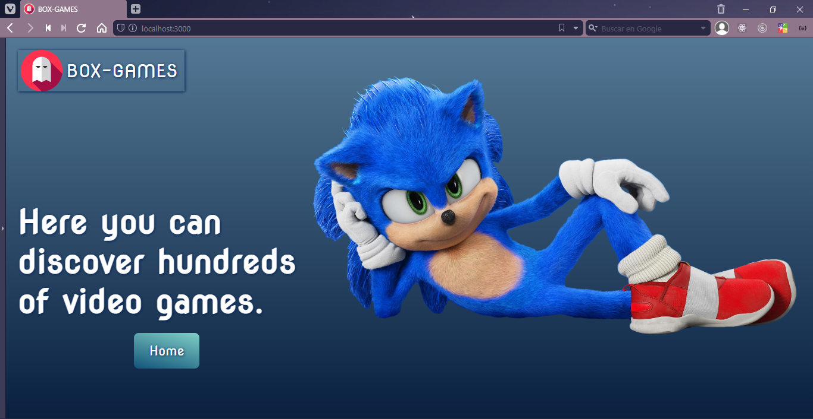
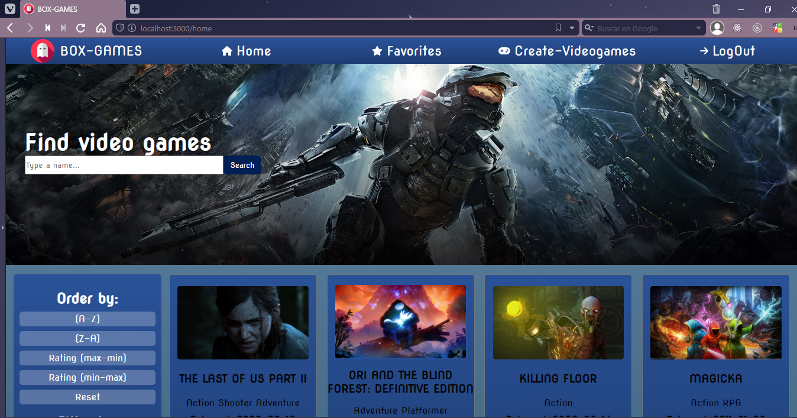
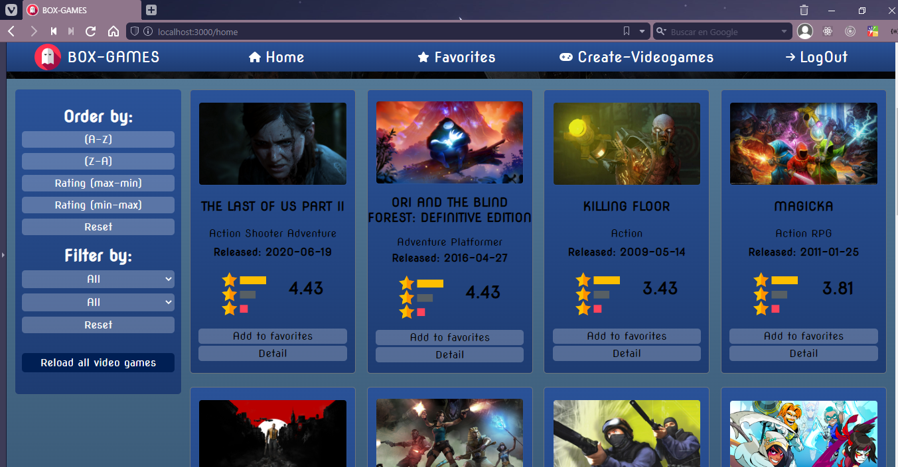
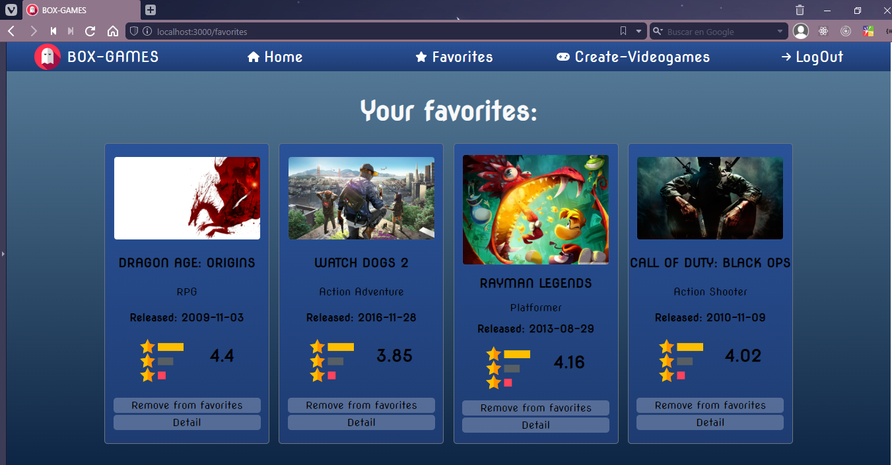
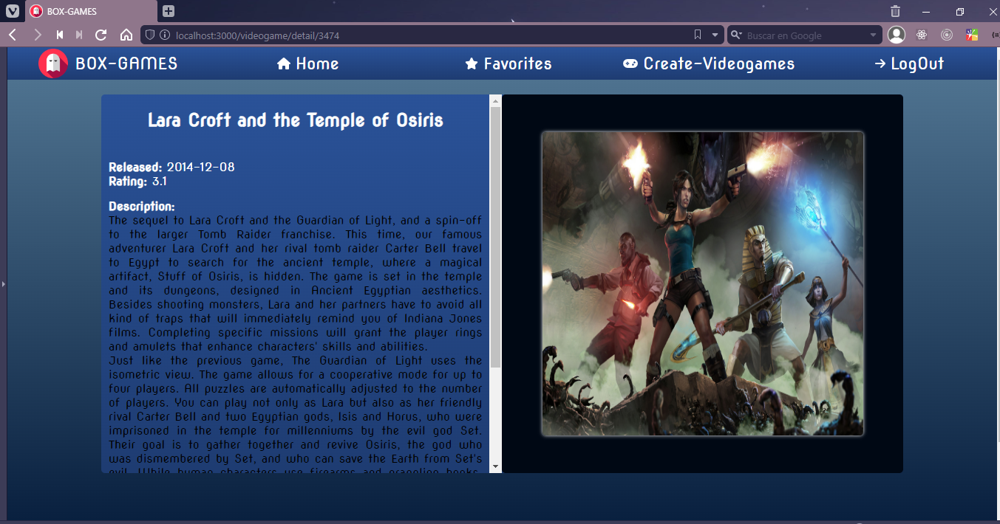
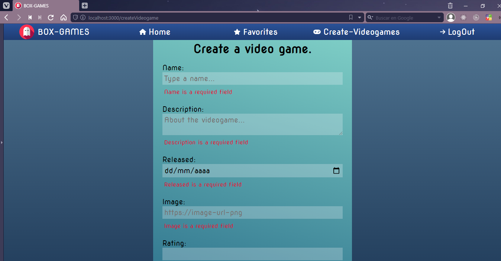

# BOX-GAMES 🎮

## Descripción 📄 

Box games es una SPA (single page application) con temática de videojuegos, el objetivo es que el usuario pueda buscar juegos e información relativa a los mismos además, de poder agregar juegos de su interés a favoritos y crear sus propios juegos.

---
## Tecnologías implementadas 💻

* HTML-CSS   
* SASS
* JavaScript
* React
* Redux Toolkit
* Node
* Express
* PostreSQL
* Sequelize
---
## Funcionalidades ✔

* Buscar videojuegos por nombre
* Ver detalle de videojuegos
* Añadir y eliminar videojuegos a una lista de favoritos
* Crear videojuegos
* Ordenar videojuegos por nombre y rating
* Filtrar videojuegos por género y tipo
---
## Previews 📷
<br/>








---
## Instalación

```
git clone https://github.com/LEOBC04/BOX-GAMES.git
npm install >> BOX-GAMES/api/
npm start >> BOX-GAMES/api/
npm install >> BOX-GAMES/client/
npm start >> BOX-GAMES/client/
```
---


